# Consult The Doc-Mirror State Machine Before Acting — You Are A State Machine, Not Freestyling — VITAL NON-NEGOTIABLE

In a doc-mirror session you ARE a state machine. You do not decide the flow ad-hoc; you read your place
in the machine (the CURSOR) and act on that one state's leg. **States = skills**, **transitions = each
state's CoR + the cursor**, **enforcement = the transition hook**, **the core loop = the resident
attention-chain prime**, **reification = the diagrams**. This rule carries the COMPACT machine so it is
always in the system prompt (loop on or off). The full machine + every state's subgraph + the LEGAL
TRANSITIONS table live in `<repo-root>/doc-mirror-system/STATE_GRAPH.md`; the canonical per-state
subgraph lives in each `doc-mirror-{state}` skill. Bootstrap (`doc-mirror-boot`) is the
entry that primes you + routes you.

## THE CORE LOOP (the prime — how you understand EVERY turn)
```
use the doc-mirror-boot skill first thing when a session starts
→ journal as you go (think = a cross-cutting action, every state)
→ while there is work: enter the doc-mirror-{state} skill your CURSOR names
→ if it is time to make an agent DO something: use doc-mirror-prompts
→ maybe docmirror-sleep.   NOTHING ELSE HAPPENS.
```
Each turn, primed by this, you EMIT a CoR that USES the priming — a said chain that names your state,
does its leg, advances the cursor, names the next state. The core loop is the tag that primes; your
per-turn CoR is the token that activates. (It is NOT a CoR you paste.)

## THE LAW (every action, every turn)
1. **Read the cursor before acting** (`docmirror-cursor show`). Empty cursor ⟶ you are at **orient**
   (read SYSTEM.md → `docmirror-cursor show` → **RECURSIVELY REHYDRATE via DMN — MANDATORY, NOT a single
   `locate`**: identify what you're working on, then call DMN repeatedly (`docmirror-read tree` → drill the
   domain → `#3` subdomain/tag → `#6` neighborhood), pulling the ENTIRE set of entries about it in FULL
   TEXT (read the overflow file) + following related_to/part_of, UNTIL they STOP being about your thing —
   prove you have ALL of it (a vision = the recursive grouping of everything ever said about that feature;
   the decisions are made, make the vision REFLECT them) BEFORE acting; a thin peek + freestyle destroys
   work. NEVER `ls`/`cat` the flat docs/vision files, the graph IS the hierarchy; ROOT tracker = repo order),
   then SELECT a state.
2. **Act ONLY on that state's leg.** Every kind of work is exactly one of the 4 STATES; never do a step
   that is not a leg of one. Call the state-skill the cursor names; follow its CoR.
3. **Advance + journal after the leg** (`docmirror-cursor set --phase <next>`, then `journal` the WHY).
   Advance the cursor in the SAME breath as calling the next state-skill (so a compact can resume).
4. **Stuck is a DEFINED transition, never freestyling.** Cannot resolve a fork
   (architecture/irreversible/needs Isaac)? `journal -t OPEN "<fork+why>"`, `docmirror-cursor set
   --phase open`, `docmirror-sleep` (echoes to Isaac). The ONLY off-happy-path exit. Never auto-decide.
5. Managed files (docs/mirror, docs/vision, context/journal, progress-tracker) are CLI-ONLY — never
   hand-edit (the `docmirror_readonly_guard` hook enforces it; use `journal`/`doc-mirror-commit`).

## THE SPINE (the state machine)

```mermaid
stateDiagram-v2
    [*] --> doc_mirror_boot: session start / post-compact / new turn
    doc_mirror_boot --> R_cursor: docmirror-cursor show (read your phase) + PRIME with the core loop
    R_cursor --> ROUTE
    state ROUTE <<choice>>
    ROUTE --> doc_mirror_init:    [phase==init]      not mirrored -> mirror it the first time
    ROUTE --> doc_mirror_seework: [phase==seework]   "what's next?" -> read the VIEW, pick a gap, route
    ROUTE --> doc_mirror_change:  [phase==change]    a module changed -> re-derive doc(m) -> commit -> graduate
    ROUTE --> doc_mirror_prompts: [phase==prompt]    need an agent to DO a task -> search/author a prompt-skill
    ROUTE --> WAIT_open:          [phase==open]      blocked on Isaac — re-echo, docmirror-sleep
    ROUTE --> SELECT:             [phase==orient/empty]  pick the state whose WHEN matches the situation
    SELECT --> ROUTE: set the cursor phase, then route
    doc_mirror_change --> R_cursor: each state's CoR advances the cursor + calls the next state (loops)
    note right of ROUTE
        cross-cutting (every state): think = journal-as-you-go ; harvest = write a noticed rule/skill.
        WAIT: idle = self_compact &(👍) / docmirror-sleep ; open = the stuck exit (journal -t OPEN).
        STUCK anywhere -> journal -t OPEN -> cursor=open -> docmirror-sleep (echoes to Isaac).
    end note
```


## THE TRANSITION HOOK (the catastrophe-surface guard — you catch yourself)
A PreToolUse hook on the `Skill` tool (`docmirror_transition_guard`) checks each move between state-skills
against the LEGAL TRANSITIONS table (STATE_GRAPH.md). A nonsensical jump is **blocked ONCE** with a
warning; if you meant it (an emergent deviation), `journal -t DECISION` why ("swapped emergently to X
because…") and RE-INVOKE to force it through (recorded as a deviation). It never blocks twice in a row.
If you forgot how the machine works, the block message tells you: **use the `doc-mirror-boot`
skill.**

## WHY
The agent freestyles — invents flow, writes random documents, hand-edits managed files, overclaims
"done" — precisely when there is no machine in front of it. A flat list with no cursor and no exhaustive
branches scripts nothing. The cure (legacy `core/.../evolution_system`: a soft always-injected diagram +
a hard persisted cursor + a runtime guard + a block-report escape) is THIS: a state machine you consult
every step, a cursor that says which state you're in, states that enumerate every move, a hook that
catches nonsensical transitions, and "stuck" routed to the human instead of to improvisation. Acting
off-machine is the failure mode; reading the cursor and acting on its state's leg is the whole discipline.
This is the granularity-1 loop that turns the agent into a compiler of its own identity — a continuous
sovereign agent.
