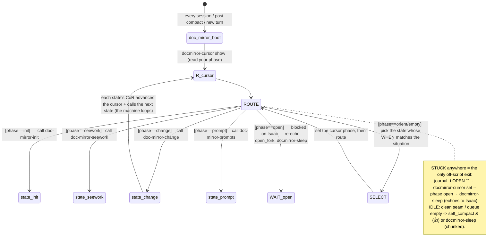

# doc-mirror-boot — START HERE, every session

This is **step 0**. You read this first, always. It does three things: (1) PRIMES you with the **core
loop**, (2) tells you how the doc-mirror **state machine** runs, (3) routes you to the state your cursor
names. You never improvise — you read your cursor and call the state-skill it names, emitting a CoR that
uses the core-loop priming.

## 1. THE CORE LOOP (the prime — how to understand every turn)

The core loop is the **resident attention chain** that primes you each turn. It is NOT a CoR you paste;
it is the standing priming that your per-turn CoR then *activates*. Hold this as the shape of every turn:

```
use the doc-mirror-boot skill first thing when a session starts
→ journal as you go (think = a cross-cutting action, every state, the moment a thought occurs)
→ while there is work: enter the appropriate doc-mirror-{state} skill (your CURSOR names which)
→ if it is time to make an agent DO something: use doc-mirror-prompts
→ maybe docmirror-sleep.   NOTHING ELSE HAPPENS.
```

**Each turn, primed by this, you EMIT a CoR that uses the priming** — a said reasoning chain that names
the state you're in, does that state's leg, advances the cursor, and names the next state. The core loop
is the tag that primes you; your per-turn CoR is the token that activates it. (Do NOT mistake the core
loop for "a CoR I paste" — it is the unsaid priming; the CoR is the said activation.)

## 2. THE STATE MACHINE (how doc-mirror runs)

The doc-mirror flow is a **state machine**: **states = skills**, **transitions = each state's CoR + the
cursor**, **enforcement = the transition hook**, **reification = the diagrams** (`STATE_GRAPH.md` +
`SYSTEM.md` + the always-on rule). You are always *inside* one state; you do its leg, advance the cursor,
and call the next state — the machine loops itself.

Your place in the machine is the **CURSOR** — `docmirror-cursor` (persisted at `<root>/.docmirror/cursor.json`,
survives compacts). It is the authority: **your cursor's `phase` names the state-skill you call.** The
skill descriptions are discovery; the cursor is the deterministic router.



## 3. THE STATES (= the skill list = the cursor phases)

| phase | state-skill | what it is |
|---|---|---|
| boot | `doc-mirror-init` | mirror an unmirrored codebase the first time (enumerate→doc(m)+vision(m)→synthesize→layers→closure) |
| seework | `doc-mirror-seework` | the backlog VIEW (`vision stats`→`project`→`diff`) → pick the next gap → route to its state |
| change | `doc-mirror-change` | a module changed → re-derive doc(m) → `doc-mirror-commit` w/ ORIGIN → graduate vision→impl |
| prompt | `doc-mirror-prompts` | need an agent to DO a task → search/author a reliability-scored prompt-skill |

Not states (no transition gate): **think** (journal-as-you-go) and **harvest** (noticed a reusable
rule/skill) are CROSS-CUTTING actions inline in every state. **idle** and **open** are WAIT states —
`docmirror-sleep` / `self_compact` (idle), or `journal -t OPEN` → sleep → Isaac (open). They live in this
spine, not in their own skills.

Reference docs (not states): **`doc-mirror`** = THE LAW (the invariant all states operate under — 4 legal
file kinds, deterministic addressing, doc(m) template, closure test, fork-on-change). **`make-ai-operating-
system`** = the L2 architect for designing NEW systems of this class.

## THE STATE-SKILL TEMPLATE (every `doc-mirror-{state}` skill is exactly this shape)

```
1. {the state's subgraph mermaid}         ← the shape (one canonical place for THIS subgraph)
2. {explanation}                           ← what this state is, the said/symbolic context
3. {CoR — the binding + the transition}:
   "Now that I've read {this state}, I will {the state's inner CoR — its concrete steps}, then I
    advance the cursor (`docmirror-cursor set --phase {next}`) and call `{next state-skill}`
    — or, if {branch condition}, call `{alt state-skill}` instead.
    If I hit a fork I cannot resolve (architecture / irreversible / needs Isaac): I `journal -t OPEN
    "<fork + why>"`, `docmirror-cursor set --phase open`, and `docmirror-sleep` — I call no next; I wait."
```
Three invariants the template enforces: **conditional next** (the CoR names the branch's successors),
**cursor-coupled** (advance the cursor in the same breath as the call, so a compact can resume), and
**stuck = a defined exit** (OPEN → sleep → Isaac), never freestyling.

## THE TRANSITION HOOK (why you might land here mid-session)

A PreToolUse hook on the `Skill` tool checks that each state transition is sensical (per the LEGAL
TRANSITIONS table in `STATE_GRAPH.md`). If you make a nonsensical jump it **blocks you once** with a
warning and the line *"To gain understanding of the compiler/state machine, just use the
doc-mirror-boot skill."* That is the catastrophe-surface guard letting you catch yourself —
if you genuinely meant the jump (an emergent deviation), `journal -t DECISION` why ("swapped emergently
to X because…") and RE-INVOKE the state-skill to force it through. If you forgot how the machine works,
you're reading the right skill now.

## What you need (confirm present)

- The CLIs on PATH: `docmirror-cursor`, `journal`, `vision`, `plan`, `projects`, `doc-mirror-commit`.
- The overview docs (the human map): `STATE_GRAPH.md` (full machine) + `SYSTEM.md` (the 4 glance diagrams).
- The repo root resolves (env `DOCMIRROR_MONOREPO` / `~/.docmirror_root` / git toplevel). `journal --where`
  confirms it.

## CoR (doc-mirror-boot's own binding — the priming, then the route)

Now that I've read `doc-mirror-boot`, I am PRIMED with the core loop, and I will ORIENT —
read `SYSTEM.md` + the ROOT `progress-tracker` (which names the active repo) + that repo's context, then
run `docmirror-cursor show` to read my **phase**. I call the state-skill for that phase (per the table)
and follow its CoR; if the cursor is empty I SELECT the state whose WHEN matches the situation and set the
phase first. I emit a CoR each turn that USES the core-loop priming. I act ONLY on the named state's leg;
I advance the cursor and `journal` as I go; on an unresolvable fork I `journal -t OPEN` and `docmirror-sleep`.
I never freestyle — I am always inside one state of the machine.
