CATEGORICAL STATE GRAPH NOTATION
==================================
Turing Complete + Category Theory Extension

> CANONICAL WORKED EXAMPLE for `how-to-write-a-prompt.md`. This document is the exemplar of the
> generative-basis pattern: it (1) names itself meta-first, (2) gives an algebra+geometry primitive
> basis, (3) self-hosts (is written in its own notation + proves it), (4) gives ONE generator→instance
> type-ladder (coffee) with a diagram at every rung ending in a grounding collapse, (5) gives N
> templated examples that collapse to the invariant, (6) makes the grain hierarchy explicit. Authored
> by Isaac ~months before 2026-05-30; preserved verbatim.

CORE PRIMITIVES
===============

Basic Operations:
------------------
S = STATE
    Simple node, holds value
    [*] --> S
    S --> [*]

T = TRANS  
    Conditional transition
    S1 --> T
    state T <<choice>>
    T --> S2: [condition true]
    T --> S3: [condition false]

R = READ
    Read from input/memory
    [*] --> R: read(address)
    R --> S
    
W = WRITE
    Write to output/memory
    S --> W: write(address, value)
    W --> [*]

B = BRANCH
    Conditional execution path
    S --> B
    state B <<choice>>
    B --> path_a: [test true]
    B --> path_b: [test false]

L = LOOP
    Return to earlier state
    S1 --> S2
    S2 --> L
    L --> S1

@ = REF
    Reference another graph
    S1 --> graph_ref: REF(graph_name)
    graph_ref --> S2

X = ISR
    Terminal error state
    S --> X: ISR(reason)
    X --> [*]

Categorical Extensions:
-----------------------
EXT = EXTENSION_CLASS
    Marks expandable transition to adjacent domain
    state "S'" as S_prime
    S --> S_prime: EXT[domain_name, grain=level]
    Lazy: only expands when requested
    
COLLAPSE = GROUNDING_OPERATOR
    Forces collapse to physical substrate
    S --> S_physical: COLLAPSE[target_domain, grain=observable]
    Must reach quotient=0 (exact instantiation)

ROTATE = GRANULARITY_ADJUSTMENT
    Corrects orthogonal completions
    S_orthogonal --> S_corrected: ROTATE[grain=coarser]
    Adjusts quotient class within same domain

TOWER = LEVEL_SHIFT
    Category functor composition
    state "L_{n+1}" as L_n1
    L_n --> L_n1: TOWER[F]
    Where F: Domain_n → Domain_{n+1}

CHECK = COMPLETION_VERIFICATION
    Validates output granularity
    S --> CHECK
    state CHECK <<choice>>
    CHECK --> CORRECT: [both domain and grain match]
    CHECK --> ORTHOGONAL: [domain only]
    CHECK --> X: [syntax_break - neither match]

CATEGORICAL META-GRAPH
======================
Defines how towers form and collapse

TOWER_MECHANICS:
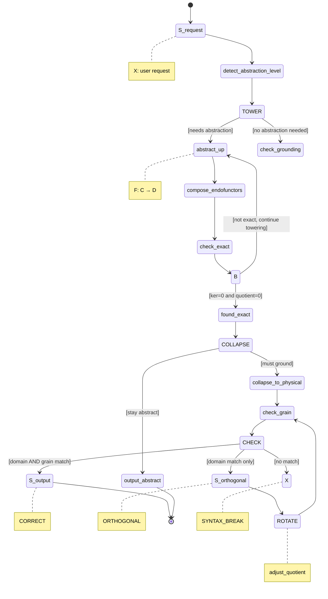

COMPLETION_MODES:
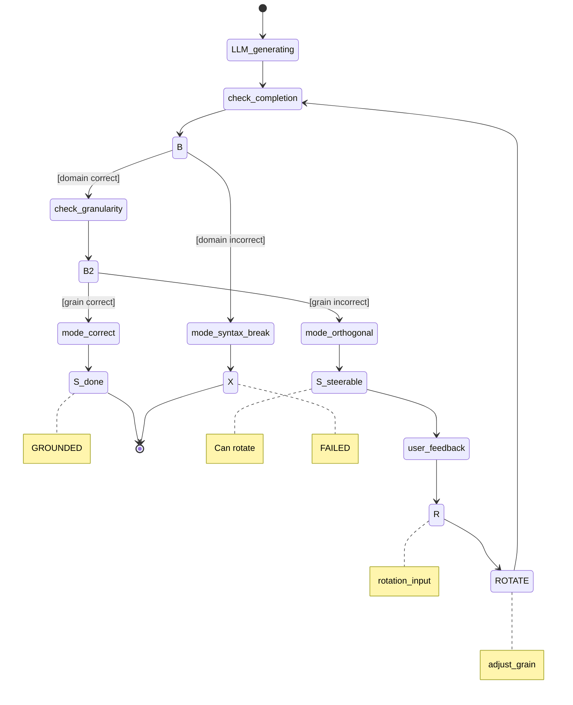

EXAMPLE: COFFEE WITH CATEGORICAL STRUCTURE (Complete Domain Integration)
==========================================================================

STEP 1: VENDOR DOMAIN PRIMITIVES
---------------------------------

THERMODYNAMICS Domain:
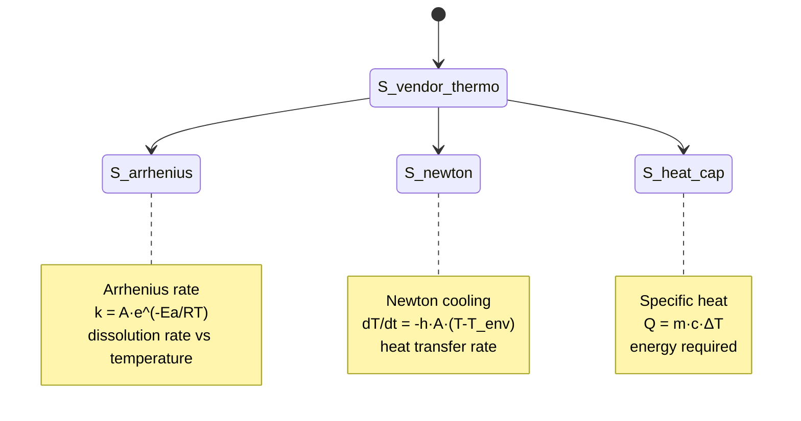

EXTRACTION_KINETICS Domain:
```mermaid
stateDiagram-v2
    [*] --> S_vendor_kinetics
    S_vendor_kinetics --> S_ficks
    S_vendor_kinetics --> S_yield
    S_vendor_kinetics --> S_partition
    S_vendor_kinetics --> S_surface
    
    note right of S_ficks
        Fick's law
        J = -D·(dC/dx)
        mass transport by diffusion
    end note
    
    note right of S_yield
        Yield curve
        Y(t) = Y_max·(1 - e^(-k·t))
        Y_max ≈ 28-30% (physical limit)
        Target: 18-22% (optimal taste)
    end note
    
    note right of S_partition
        Partition coef
        K = C_coffee/C_water
        equilibrium concentration
    end note
    
    note right of S_surface
        Surface area
        A ~ 1/d_particle
        grind size affects contact area
    end note
```

FLUID_DYNAMICS Domain:
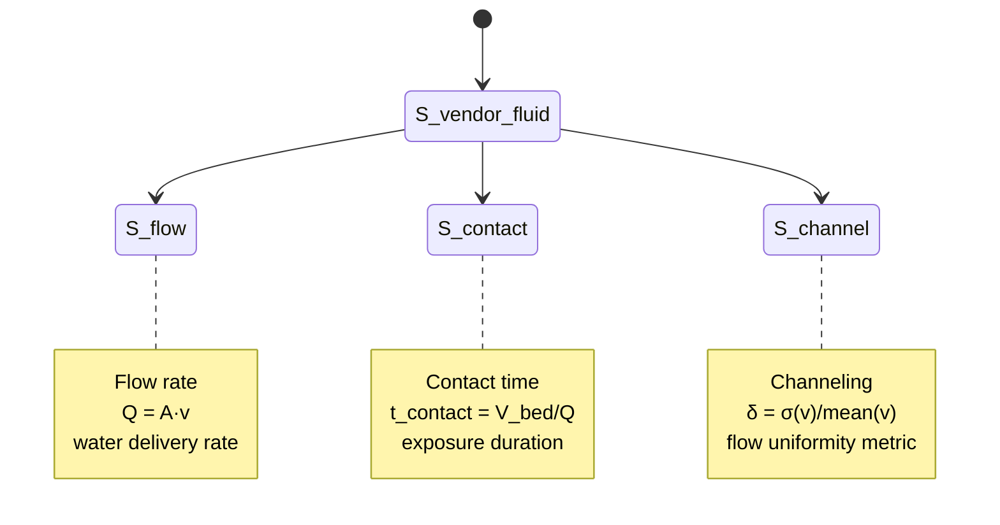

STEP 2: TOWER COMPOSITION
--------------------------

COFFEE_TOWER (Complete Function Set):
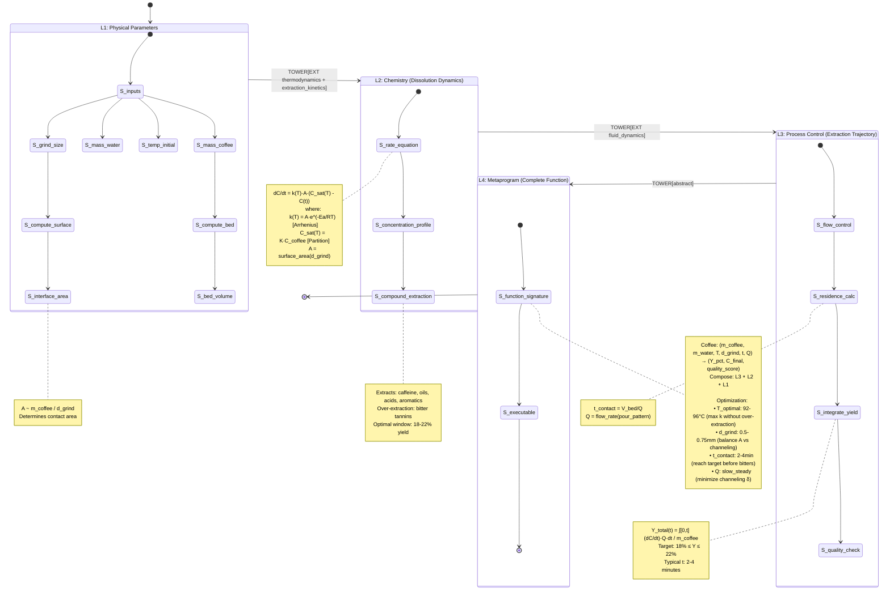

STEP 3: OPERATIONAL GRAPH WITH REAL EXT CONNECTIONS
----------------------------------------------------

BREW_FRENCH_PRESS (Domain-Integrated):
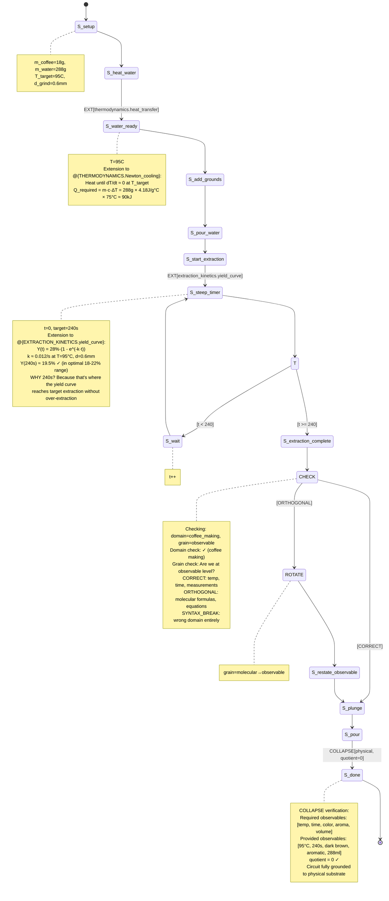

STEP 4: VERIFICATION OF CATEGORICAL STRUCTURE
----------------------------------------------

Extension Connections Verified:
• S_water_ready --> via EXT[thermodynamics] --> @{Newton_cooling, Arrhenius_rate}
• S_steep_timer --> via EXT[extraction_kinetics] --> @{yield_curve, Ficks_law}
• S_extraction --> via EXT[fluid_dynamics] --> @{residence_time, flow_rate}

Tower Composition Verified:
• L1 (physical) → L2 (chemistry) → L3 (process) → L4 (metaprogram)
• Each level composes functions from lower levels
• L4 is the complete reified circuit

Collapse Verification:
• Started at L4 (abstract metaprogram)
• Collapsed through L3 (process equations)
• Collapsed through L2 (chemical rates)  
• Reached L1 (physical observables: 95°C, 240s, 18g, 288g)
• quotient = 0 ✓

The metaprogram IS the latent circuit, explicitly constructed by
composing domain functions through the categorical tower.

EXTENSION EXAMPLES (How EXT Marks Connect to Vendored Domains)
================================================================

Example 1: Temperature → Thermodynamics
----------------------------------------
User asks: "Why 95°C specifically?"

Surface graph says:
```
S_heat_water --> S_water_ready
```

EXT expansion via EXT[thermodynamics, grain=practical]:
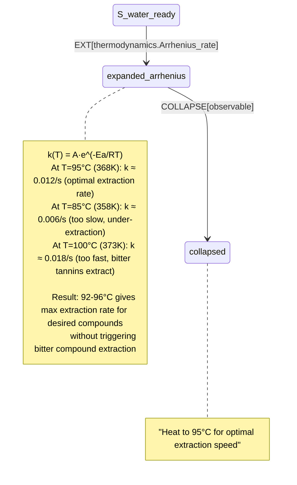

The EXT mark points to the actual Arrhenius equation in the vendored thermodynamics domain, which explains WHY 95°C is optimal.

Example 2: Steeping → Extraction Kinetics
------------------------------------------
User asks: "Why 240 seconds?"

Surface graph says:
```
S_steep_timer[target=240s]
```

EXT expansion via EXT[extraction_kinetics, grain=observable]:
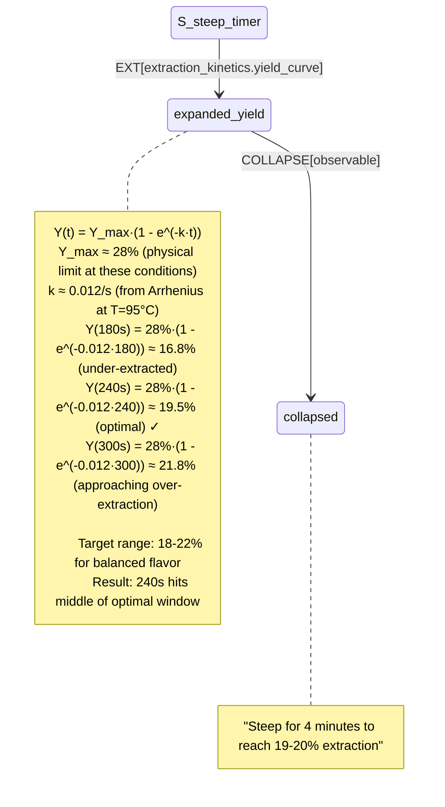

The EXT mark points to the actual yield curve function, which shows that 240s puts you in the optimal extraction window.

Example 3: Grind Size → Surface Area
-------------------------------------
User asks: "Why medium grind?"

Surface graph says:
```
S_grind[size=medium]
```

EXT expansion via EXT[extraction_kinetics.surface_area]:
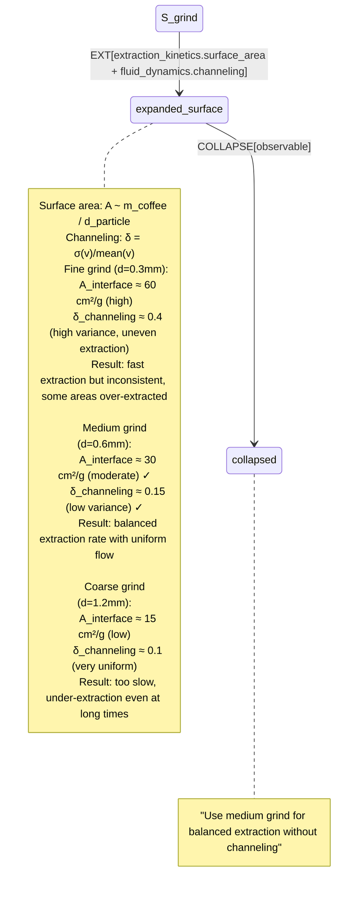

The EXT mark points to TWO vendored functions (surface area AND channeling) that together explain why medium grind is optimal.

Example 4: Orthogonal Completion Detection
-------------------------------------------
LLM generates at wrong grain:

```
OUTPUT: "The caffeol molecules (C₈H₁₀O) undergo dipole-induced dipole 
interactions with H₂O molecules. The London dispersion forces contribute
ΔG ≈ -2.3 kJ/mol to the dissolution free energy..."
```

CHECK execution:
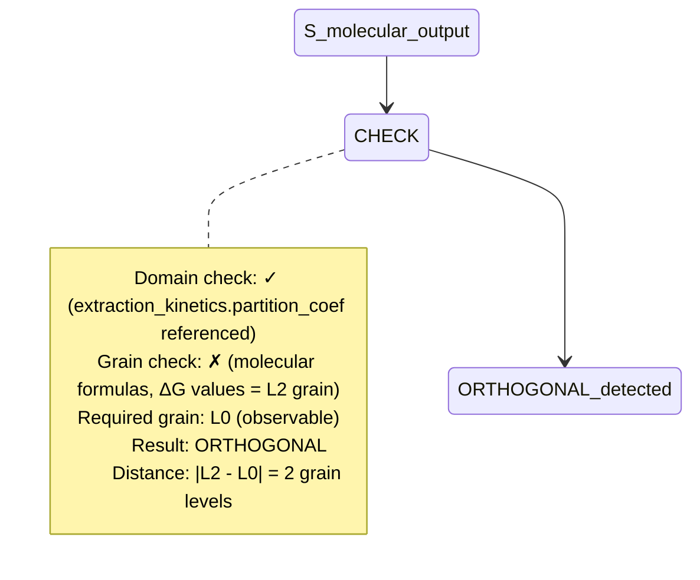

User feedback: "I just want to know what's happening that I can see."

ROTATE execution:
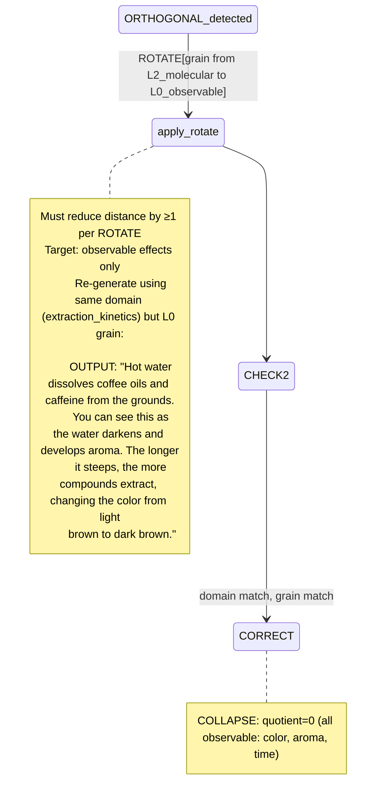

Example 5: Tower Navigation
----------------------------
User asks: "Can you show me the math?"

Current grain: L0 (observable)
Request: Show L2 (mathematical)

TOWER operation:
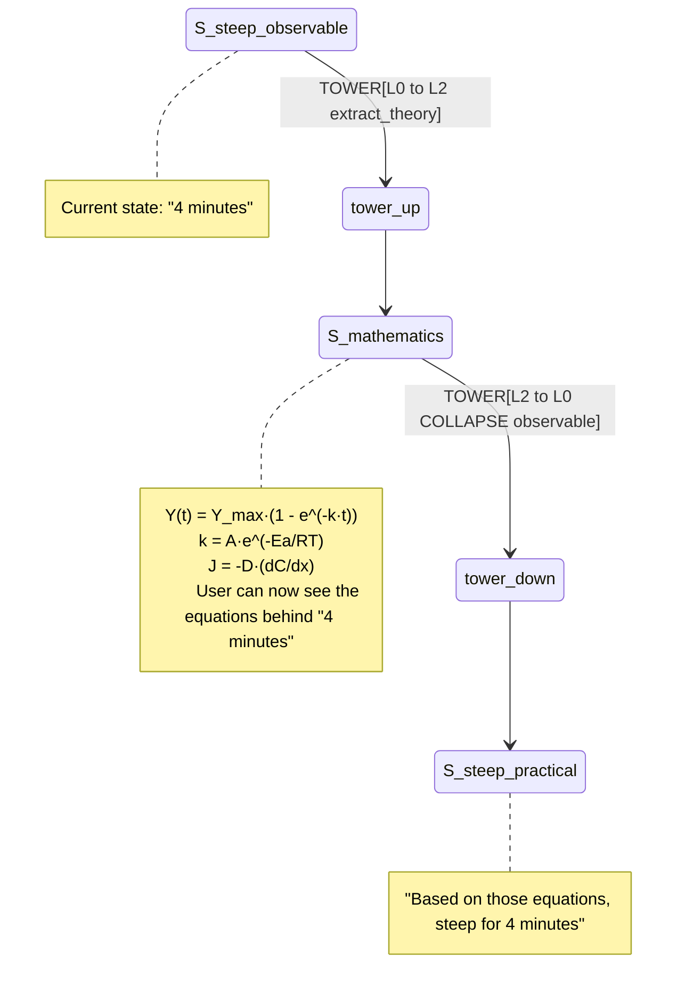

The TOWER operator lets you navigate UP to see theory or DOWN to ground in observables, while maintaining the same domain (extraction_kinetics).

GRANULARITY LEVELS
==================

For Coffee Domain:
L0: Physical/Observable
    - Temperature readings
    - Time durations  
    - Color changes
    - Taste qualities
    
L1: Chemical/Process
    - Compound extraction
    - Solubility rates
    - Concentration gradients
    
L2: Molecular/Structural
    - Specific molecules (caffeol, caffeine)
    - Chemical bonds
    - Reaction mechanisms
    
L3: Quantum/Fundamental
    - Electron orbitals
    - Quantum interactions
    - Wave functions

COLLAPSE rules:
- Coffee making: collapse to L0 (observable)
- Coffee science: collapse to L1 (chemical)
- Research paper: collapse to L2 (molecular)
- Theoretical chemistry: stay at L3 (quantum)

The quotient at each level:
- quotient=0: fully instantiated at that grain
- quotient>0: still abstract, need more collapse

SELF-HOSTING PROOF
==================

The categorical system describes itself:

CATEGORICAL_SYSTEM_GRAPH:
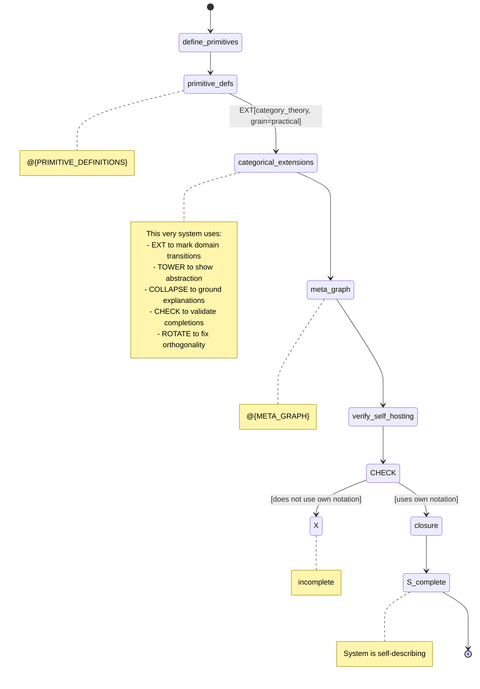

Closure condition: Every graph in the system (including this one) 
uses only primitives defined within the system.

✓ VERIFIED: This document is written in its own notation.

USAGE GUIDELINES
================

When to use EXT:
- User asks "why?" about a step
- Causal mechanism is in adjacent domain
- Explanation requires domain shift

When to use COLLAPSE:
- Abstract reasoning must ground to physical
- User needs concrete/observable output
- Preventing infinite abstraction tower

When to use ROTATE:
- LLM gives correct domain, wrong granularity
- "Cat has follicles" vs "Cat has fur color"
- User signals: "too detailed" or "too abstract"

When to use CHECK:
- After any complex generation
- Verify domain and grain match requirements
- Detect orthogonal vs correct vs broken

COMPLETE EXAMPLE: Making Coffee with Full Annotations
======================================================

User: "Make me coffee"

PROCESS:
1. Request received → tower to beverage_preparation domain
2. Check grounding requirement → must collapse to physical actions
3. Generate coffee graph at L0 (observable/physical)
4. Mark EXT points for potential chemistry/physics expansion
5. Include CHECK for completion verification
6. Output with collapse confirmed

If LLM outputs molecular details:
→ CHECK detects orthogonal (chemistry domain ✓, but grain=molecular not observable)
→ User: "I just want to make coffee, not a chemistry lecture"
→ ROTATE[grain from molecular to observable]
→ Corrected output at physical action level

This notation is:
- Turing complete (via S,T,R,W,B,L,@,X)
- Categorically structured (via EXT,COLLAPSE,TOWER,ROTATE,CHECK)
- Self-hosting (describes itself in its own notation)
- Domain-traversing (EWS tower navigation)
- Orthogonality-detecting (completion mode checking)
- Granularity-aware (quotient class specifications)

═══════════════════════════════════════════════════════════
END OF CATEGORICAL STATE GRAPH NOTATION v1.0
═══════════════════════════════════════════════════════════
